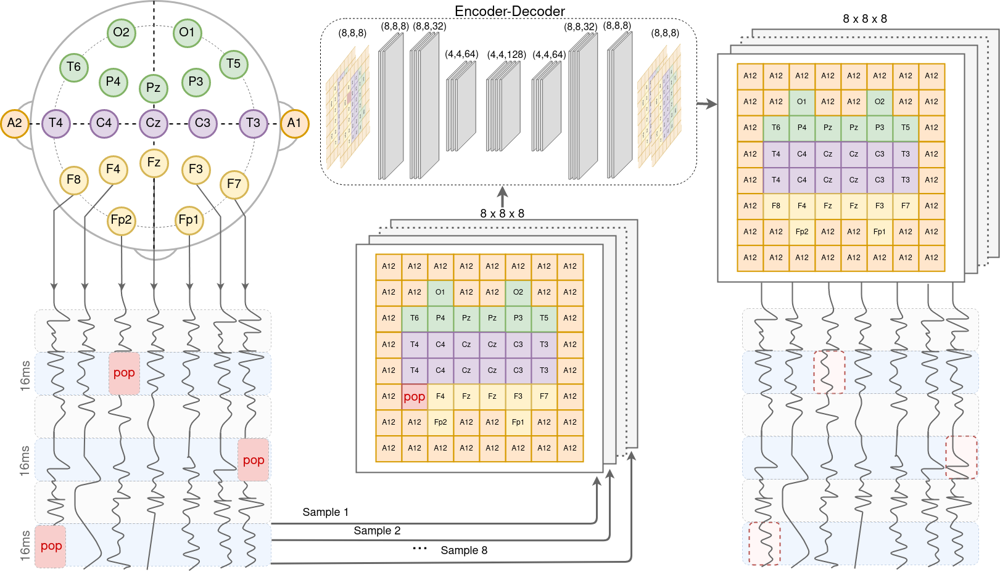

# EEG Channel Interpolation Using Deep Encoder-decoder Networks
[Sari Saba-Sadiya](https://cse.msu.edu/~sadiyasa/)<sup>1</sup>,
[Taushang Liu](https://npal.psy.msu.edu/)<sup>1</sup>,
[Tuka Alhanai](https://talhanai.xyz/)<sup>2</sup>,
[Mohammad Ghassemi](https://ghassemi.xyz/)<sup>1</sup><br>
<sup>1</sup> Michigan State University <sup>2</sup> New York University Abu Dhabi

Code for the paper "EEG Channel Interpolation Using Deep Encoder-decoder Networks", presented in BIBM-DLB2H'2020.

## Overview:
The code implemented here can be used to interpolate `poped' EEG channels. Though not restricted to any specific EEG acquisition setup, the encoder-decoder in this particular implementation was trained on data collected using a 500Hz international 10-20 system. The EEG data is first segmented into 16ms and transformed into an 8x8x8 tensor before being piped through the encoder-decoder trained to interpolate missing channels.



## Transfer learning
The performance of the trained model (available in `model`) can be further improved using transfer learning on the specific dataset you are using. See `transfer/ecr_transfer.py` for an example.

## Contents:
* `train`:  
    * `ecr_cnn.py`: The code you need to compile train and run the neural networks  
    * `ecr_hyper_parameters.npy`
    * `ecr_loadModel`: load the trained model and run it to interpolate on non-training data.
    * `run.sh` code to run the training 
* `baselines`:  
    * `ecr_baseline.py`: The code to calculate the EDP and EGL baselines.  
    * `ecr_ssp.py`: The code to calculate the spherical splines baseline.   
* `transfer`:
    * `ecr_transfer.py`: The code for transfer learning
    * `run_transfer.sh`
* `README.txt`: This file.

## Cite
```
@INPROCEEDINGS{Sadiya2020,
  author={Sari Saba-Sadiya and Taushang Liu and Tuka Alhanai and Mohammad Ghassemi},
  booktitle={2020 IEEE International Conference on Bioinformatics and Biomedicine (BIBM)}, 
  title={EEG Channel Interpolation Using Deep Encoder-decoder Networks}, 
  year={2020},
  pages={},
  doi={}
}
```
